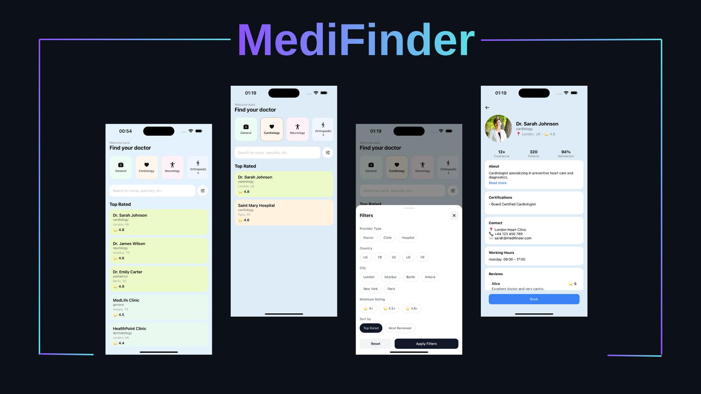

# 📱 MediFinder – Mobile Engineer Case Study

A clean and scalable React Native application that demonstrates a provider discovery flow with filtering, search, and detail navigation.



---
🎥 Demo
<p align="center">
  
</p>

## 🚀 Overview

This project implements a simplified provider discovery experience with three main screens:

- Provider List
- Filter Modal
- Provider Detail

The main goal is to demonstrate:
- Clean and scalable architecture
- Component reusability
- State management approach
- UX handling (loading, empty states)
- Maintainable code structure

---

## 🧱 Tech Stack

- React Native (Expo)
- TypeScript
- React Navigation
- Functional components + Hooks
- Mock data (no backend)

---

## 📂 Project Structure

Feature-based architecture is used for scalability and separation of concerns.

```text
src/
├── features/
│   ├── providers/
│   │   ├── components/
│   │   ├── screens/
│   │   ├── hooks/
│   │   ├── utils/
│   │   └── services/mock/
│   ├── filters/
│   └── shared/
│       ├── components/
│       ├── constants/
│       ├── hooks/
│       ├── utils/
│       └── types/
├── navigation/
```


### Design Decisions

- Feature-based modular structure
- Separation of UI and business logic
- Reusable shared components
- Mock data isolated in service layer
- Custom hook for filtering logic

---

## 🧠 State Management

- Local state with `useState` for UI interactions
- Centralized `FilterState` for filtering logic
- Derived provider list via custom hook:

```ts useFilteredProviders(providers, filters)  ```ts

This ensures clean separation between UI and business logic.


🔍 Features

Provider List

* Search by name, specialty, or keyword
* Provider cards show:
    * Name
    * Specialty
    * City / Country
    * Rating
* Empty state handling

Filtering

Users can filter providers by:

* Country
* City
* Provider type (Doctor / Clinic / Hospital)
* Minimum rating
* Specialty

Filter logic is implemented with a toggle-based approach for better UX.

⸻

Provider Detail

* Basic profile information
* Contact info (mock structure)
* Bio / description section

⸻

⏳ Loading State

A simulated loading state is implemented to improve UX realism.

* Fake delay (500–1000ms)
* Loading screen shown before data render

```tsx

<LoadingState text="Loading your results..." />

```
📭 Empty State

When no providers match filters:

* Friendly empty state UI
* Suggests changing filters or search terms

## 🧪 Testing

This project includes example unit tests for core business logic.

Tests focus on:
- Provider filtering logic
- Search functionality
- Edge cases (empty results, null filters)

### Example

```ts
import { filterProviders } from "./filterProviders";

const mockProviders = [
  { id: "1", name: "Dr. A", city: "Ankara", country: "TR", type: "doctor", rating: 4.5, specialty: "cardiology" },
  { id: "2", name: "Clinic B", city: "Istanbul", country: "TR", type: "clinic", rating: 3.9, specialty: "dermatology" },
];

test("filters providers by city", () => {
  const result = filterProviders(mockProviders, {
    city: "Ankara",
    country: null,
    type: null,
    minRating: null,
    search: "",
    specialty: null,
  });

  expect(result).toHaveLength(1);
  expect(result[0].city).toBe("Ankara");
});```

## 🧪 Testing & Bonus Scope Decisions

The project includes example unit tests covering core business logic (especially provider filtering logic in `filterProviders`).

Due to dependency conflicts in the current Expo + React setup, a full test runner configuration (Jest / React Native Testing Library) was not activated to avoid introducing instability to the project environment.

Instead, the application was designed with testable pure functions, allowing business logic to be tested independently from the UI layer.

### Example Test Coverage

- Filter providers by city
- Filter by country
- Filter by specialty
- Search-based filtering
- Edge case handling (empty results, null filters)

A sample test file is included in the repository under the relevant feature folder, demonstrating unit test structure and expected behavior.

---

### Bonus Scope Decisions

To keep the project lightweight and stable within Expo constraints:

- Offline support was implemented as a simplified UX state instead of adding native networking dependencies (e.g. NetInfo).
- External testing frameworks were not executed but test structure was prepared.
- Additional tooling (e.g. aliasing / module resolvers) was intentionally minimized to avoid dependency resolution issues in the current setup.

These decisions were made intentionally to prioritize application stability, clarity of architecture, and smooth reviewability.